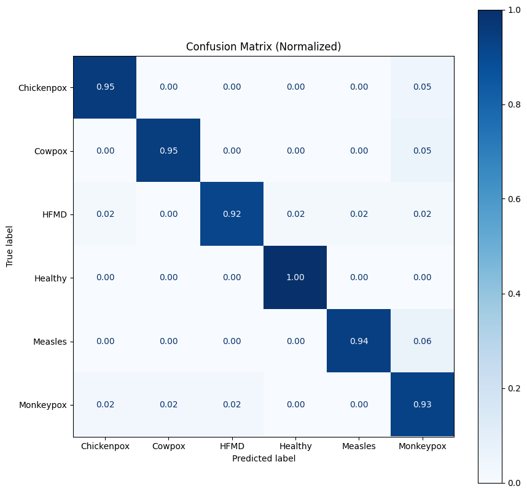
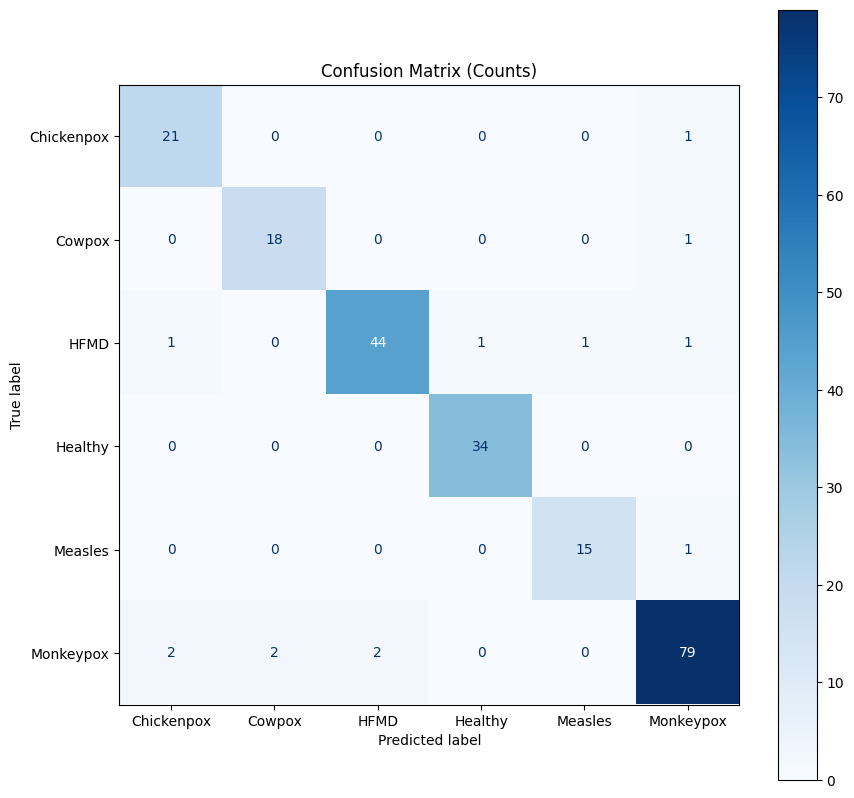

# Model Skin Disease Classifications

This repository contains the training process and experiments of models used for classification.

## Dataset
This research utilizes the **Mpox Skin Lesion Dataset Version 2.0 (MSLD v2.0)** released by Ali et al. (2023). The dataset consists of **6 classes**, which include five skin disease classes: **chickenpox, cowpox, HFMD, measles,** and **monkeypox**, as well as a **healthy** class. The dataset can be accessed [here](https://www.kaggle.com/datasets/joydippaul/mpox-skin-lesion-dataset-version-20-msld-v20). This dataset has received endorsement from professional dermatologists and obtained approval from appropriate regulatory authorities.

## Experiments
A summary of the feature extractor and classifier experiment results can be found in the tables below:

#### Experiments to find the most optimal classifier using ResNet50V2 as the feature extractor

<table border="1" cellspacing="0" cellpadding="10">
  <thead>
    <tr>
      <th rowspan="2" style="text-align: center; vertical-align: middle;">Classifier</th>
      <th rowspan="2" style="text-align: center; vertical-align: middle;">Accuracy</th>
      <th colspan="4" style="text-align: center;">Macro Average</th>
    </tr>
    <tr>
      <th style="text-align: center;">Sensitivity</th>
      <th style="text-align: center;">Specificity</th>
      <th style="text-align: center;">Precision</th>
      <th style="text-align: center;">F1-score</th>
    </tr>
  </thead>
  <tbody>
    <tr>
      <td style="text-align: center;">DT (Decision Tree)</td>
      <td style="text-align: center;">50.44%</td>
      <td style="text-align: center;">49.88%</td>
      <td style="text-align: center;">89.35%</td>
      <td style="text-align: center;">47.35%</td>
      <td style="text-align: center;">48.12%</td>
    </tr>
    <tr>
      <td style="text-align: center;">KNN (k-Nearest Neighbor)</td>
      <td style="text-align: center;">61.16%</td>
      <td style="text-align: center;">60.63%</td>
      <td style="text-align: center;">91.65%</td>
      <td style="text-align: center;">61.80%</td>
      <td style="text-align: center;">59.07%</td>
    </tr>
    <tr>
      <td style="text-align: center;"><b>SVM (Support Vector Machine)</b></td>
      <td style="text-align: center;"><b>81.25%</b></td>
      <td style="text-align: center;"><b>81.33%</b></td>
      <td style="text-align: center;"><b>95.95%</b></td>
      <td style="text-align: center;"><b>79.04%</b></td>
      <td style="text-align: center;"><b>79.99%</b></td>
    </tr>
  </tbody>
</table>

#### Further experiments to find the most optimal feature extractor using SVM as the classifier

<table border="1" cellspacing="0" cellpadding="10">
  <thead>
    <tr>
      <th rowspan="2" style="text-align: center; vertical-align: middle;">Feature Extractor</th>
      <th rowspan="2" style="text-align: center; vertical-align: middle;">Accuracy</th>
      <th colspan="4" style="text-align: center;">Macro Average</th>
    </tr>
    <tr>
      <th style="text-align: center;">Sensitivity</th>
      <th style="text-align: center;">Specificity</th>
      <th style="text-align: center;">Precision</th>
      <th style="text-align: center;">F1-score</th>
    </tr>
  </thead>
  <tbody>
    <tr>
      <td style="text-align: center;">ResNet50V2</td>
      <td style="text-align: center;">81.25%</td>
      <td style="text-align: center;">81.33%</td>
      <td style="text-align: center;">95.95%</td>
      <td style="text-align: center;">79.04%</td>
      <td style="text-align: center;">79.99%</td>
    </tr>
    <tr>
      <td style="text-align: center;">DenseNet201</td>
      <td style="text-align: center;">83.48%</td>
      <td style="text-align: center;">85.57%</td>
      <td style="text-align: center;">96.34%</td>
      <td style="text-align: center;">83.90%</td>
      <td style="text-align: center;">84.30%</td>
    </tr>
    <tr>
      <td style="text-align: center;">DenseNet121</td>
      <td style="text-align: center;">83.03%</td>
      <td style="text-align: center;">83.05%</td>
      <td style="text-align: center;">96.24%</td>
      <td style="text-align: center;">82.69%</td>
      <td style="text-align: center;">82.52%</td>
    </tr>
    <tr>
      <td style="text-align: center;">ResNet50V2 + DenseNet201</td>
      <td style="text-align: center;">91.96%</td>
      <td style="text-align: center;">91.94%</td>
      <td style="text-align: center;">98.20%</td>
      <td style="text-align: center;">91.68%</td>
      <td style="text-align: center;">91.73%</td>
    </tr>
    <tr>
      <td style="text-align: center;">ResNet50V2 + DenseNet121</td>
      <td style="text-align: center;">87.94%</td>
      <td style="text-align: center;">88.47%</td>
      <td style="text-align: center;">97.39%</td>
      <td style="text-align: center;">86.04%</td>
      <td style="text-align: center;">87.16%</td>
    </tr>
    <tr>
      <td style="text-align: center;">DenseNet201 + DenseNet121</td>
      <td style="text-align: center;">87.05%</td>
      <td style="text-align: center;">87.58%</td>
      <td style="text-align: center;">97.08%</td>
      <td style="text-align: center;">87.76%</td>
      <td style="text-align: center;">87.16%</td>
    </tr>
    <tr>
      <td style="text-align: center;"><b>ResNet50V2 + DenseNet201 + DenseNet121</b></td>
      <td style="text-align: center;"><b>94.19%</b></td>
      <td style="text-align: center;"><b>94.75%</b></td>
      <td style="text-align: center;"><b>98.75%</b></td>
      <td style="text-align: center;"><b>93.20%</b></td>
      <td style="text-align: center;"><b>93.93%</b></td>
    </tr>
  </tbody>
</table>

The following confusion matrices provide a visual representation of the model's performance in classifying skin diseases. The normalized confusion matrix highlights the percentage of correct and incorrect predictions for each class, while the count-based confusion matrix shows the raw number of predictions.

  

  

